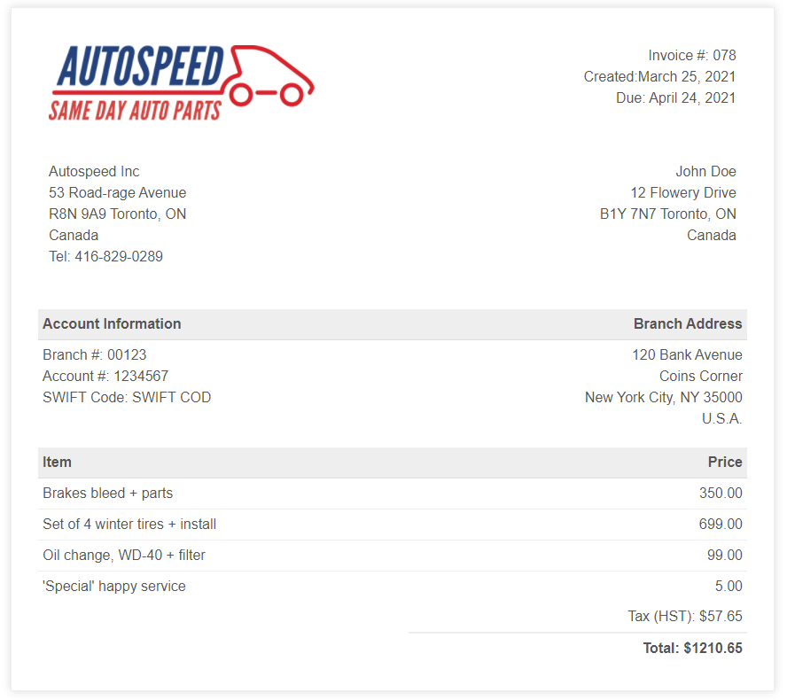

# Invoicer
A dead-simple, easy-to-use minimalist billing application.

## Downloads
You can <b>download</b> the latest release for <b>Windows</b> [HERE](https://github.com/DexterLagan/invoicer/releases/).

## Features
- produces an invoice in **one click**;
- documents **automatically titled** with invoice number, date and client name;
- **totals** calculation;
- sales **tax name** and **rate**;
- pay **interval**;
- automatic **billing, due date**;
- **localization**;
- **payment methods** (check, credit card, bank transfert);
- **simultaneous** export to **HTML**, **PDF** and **printer**;
- **invoice number tracking** accross an unlimited number of **recurring clients**.
- create an **unlimited** number of invoices using a **batch** file;
- **tiny** (12 MB compressed);
- **portable**;
- **cross-platform** (Windows 32 and 64 bits, Linux and MacOSX);
- the best user interface: **no interface**;
- **free** and open source.

## Setup
1) create a folder named after your **client**;
2) create or copy the **configuration files** inside the client folder;
3) add a **logo**.

## Configuration Files
Here is an exhaustive list of the required configuration files:
- `payee.txt`          - containing the company address;
- `payor.txt`          - containing the client's address;
- `invoice-number.txt` - containing the last current invoice number. Incremented automatically;
- `tax-rate.txt`       - containing the tax name and rate (i.e. HST|13);
- `pay-interval.txt`   - containing the pay interval (i.e. 30);
- `locale.txt`         - containing the date locale (i.e. 'en');
- `branch-address.txt` - containing the bank branch address;
- `account-info.txt`   - containing the bank account information;
- `invoice-lines.txt`  - containing the invoice lines: a brief description followed by the price, separated by a '|';
- `payment-method.txt` - containing the payment method and type or check number separated by a '|' (if applicable, see below).

## Examples
Here are a few sample configuration files, in particular those which have more than one field, with a separator ('|' by default):

Sample tax rate file: 
`HST|13`

Sample invoice line (there is no limit to the number of lines stored): 
`brake bleed|100.00`

Payment Method file examples: 
`check|123` 
or 
`transfert|0` 
or 
`credit-card|VISA`

The check number is ignored when 'transfert' is selected.

## Usage
Two ways, same result:
1) **Double-click on Invoicer**. Browse for the client folder. Out comes a **new invoice**.
2) **Run Invoicer** followed by the folder name **on the command line**. Out comes a **new invoice**.

## Planned
- currencies. Next version will support specifying one currency per client;
- a way to record each invoice metadata for later retrieval and parsing;
- global totals and sales tax for filing;
- an invoice line composer?

## Acknowledgements

Invoiced is bundled with a [simple html invoice template](https://github.com/sparksuite/simple-html-invoice-template). Use it, or use your own.

## License

Invoicer is free software; see [LICENSE](https://github.com/DexterLagan/invoicer/blob/main/LICENSE) for more details.
